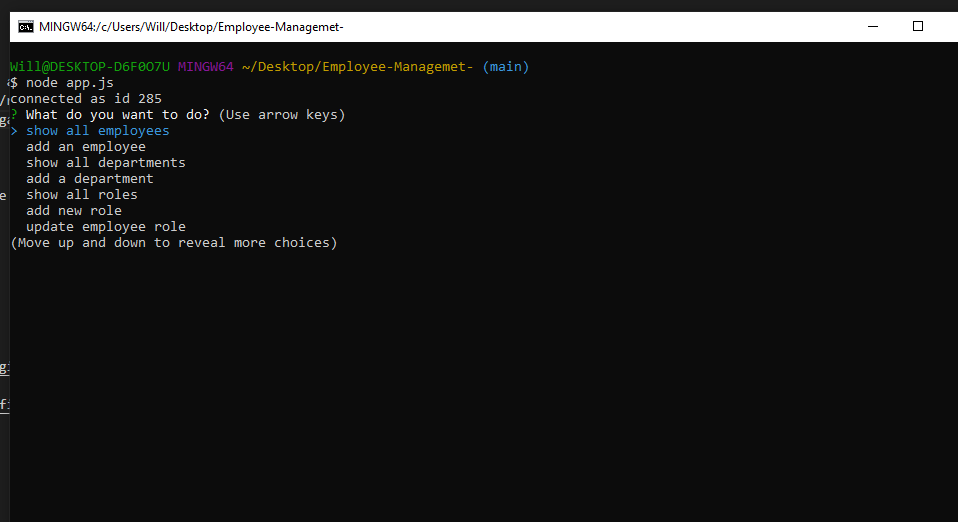

# Employee Management System

## Description

This is a program that can input, organaize, and update informattion on a company. When prompted with a main 
menu, you can choose to 'add' a new employee/role/department, or 'update' any of the above. You can also choose
to 'show' any of the aformentioned and an organized table of the respective input will return.

### Technology Used

Node.js, Javascript, Inquirer, SQL, Sequelize

### Visuals

### Links
Github Repository:
[githubRepository]  https://will98nicholson.github.io/Employee-Management/
Video Walkthough:
[videoWalkthough]  https://drive.google.com/file/d/1LbxxA6MpmnnQ3Bn6v7CfkwS2VKv6a7Wm/view